# Writeup

As of writing this (15:05 IST, Jun 21) I am ranked 32nd out of 106 in the GPU MODE leaderboard.
I stand with a geomean of ~4.7ms, which is nearly 10x faster than the `torch.geqrf` baseline. I started yesterday at 9:57 am.

I had 0 idea about about Householder reflection, parallel prefix sum, and writing triton kernels before this, hence I banked my intuition from writing performant code for CPUs and some knowledge about GPUs to push as much as I could within a day.

Final code (till now): [weareclose_warp.py](code/weareclose_warp.py)

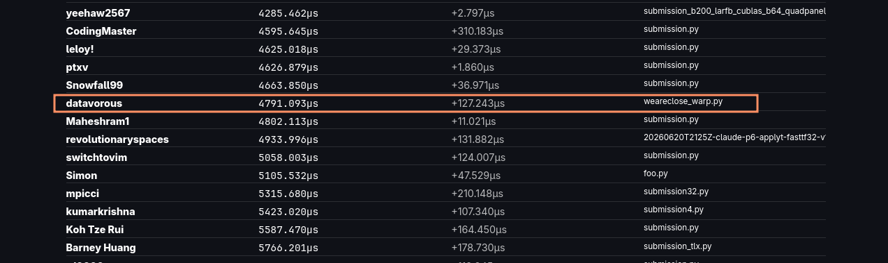

## the math

The first step in tackling a problem is to read the problem statement multiple times to get familiar with the terms.


From here, the main takeaways were:

1. "[...] in the famous words of our colleague Sonic, if we can parallelize prefix sums we can parallelize anything [...]"
2. "QR problem shows up everywhere but one recent application of interest is second-order optimization methods"

And the keywords: QR decomposition, Householder reflection, blocked Householder, parallelizable prefix sum

This was enough for me to start working.

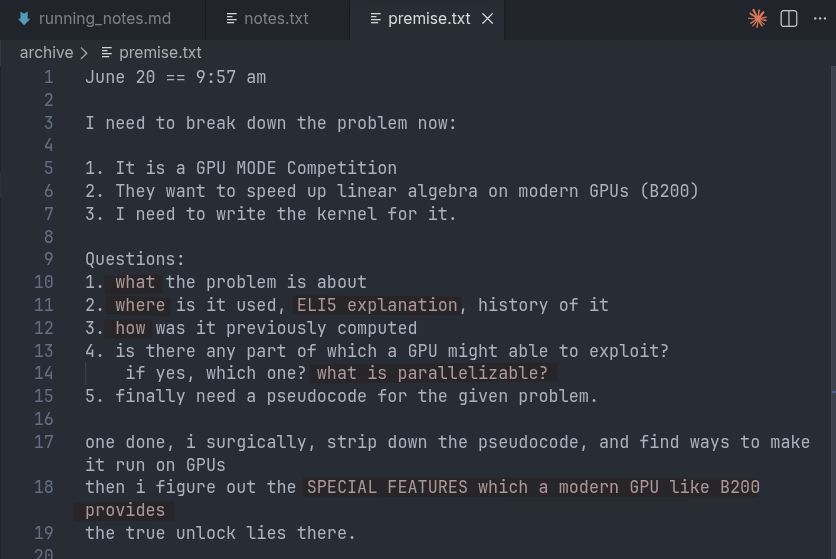

I started by writing down the fundamental questions, which are required to be answered before I write a single line of code. I skimmed through the math textbook to get an overview of it was, QR decomposition is basically factoring a matrix A into a product of a orthogonal matrix Q and a upper triangular matrix R (A = QR). Gram Schmidt was known to me, so I went on to understand what Householder was all about. I consulted with Gemini to show me a dry run of finding Q and R using Householder Reflection method.

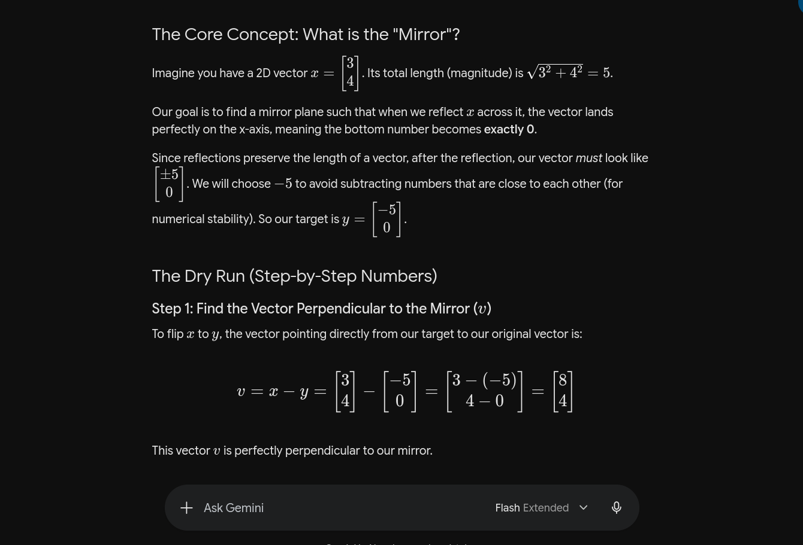

The ELI5 explanation of QR decomp and Householder stand as:

Imagine you have a messy 3D room where everything is tilted at weird angles, making it hard to measure distances or map out where things are.

QR decomp takes that messy room A, and separates it into clean parts:

a. a perfectly straight, prefectly square grid system (Q) that you can rotate but never distort  
b. a step by step instruction manual (R) that tells you how to build the original room using that clean grid

1. look at column 1, find a reflection vector v such that the reflector built from it, `H = I - tau*v*v^T`, when applied to the column, knocks out everything below the diagonal element (ie turns them to zero)
2. apply that same H to the rest of the columns
3. move to column 2, find the next v for the values below its diagonal, build its H
4. apply to the rest, and repeat

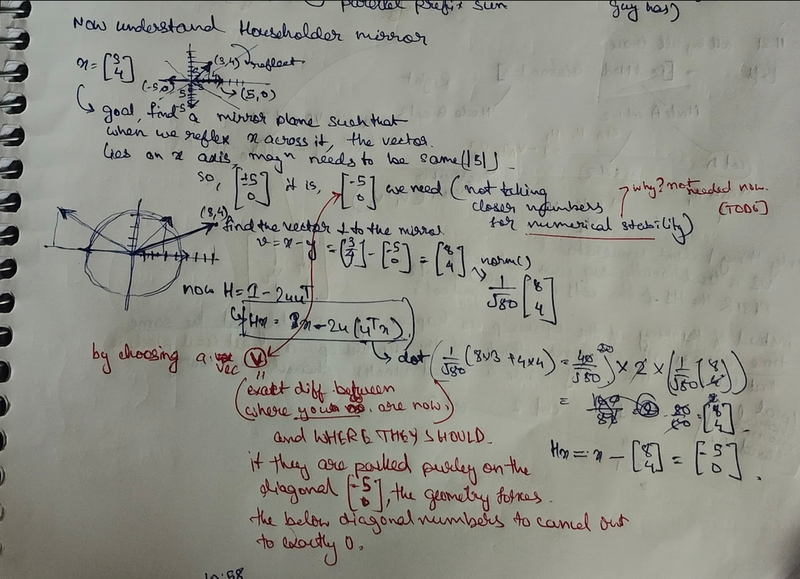

Now with the basic idea acquired, I tried to do a dry run with 3x3 matrix, and used Gemini to validate my procedure, which turned out to be just right.

From there on, I could see the "sequential" nature of Householder. We are finding the reflection vector for each column, and multiplying with the rest of the columns as well, before finding the reflection vector of the next column, and doing the same thing.

In here did I get a flashback of the prefix sum related LeetCode which I did last year, and followed the hint of "if we can parallelize prefix sums we can parallelize anything" saying from the contest announcement, to stumble across this: https://www.cs.princeton.edu/courses/archive/fall20/cos326/lec/21-02-parallel-prefix-scan.pdf

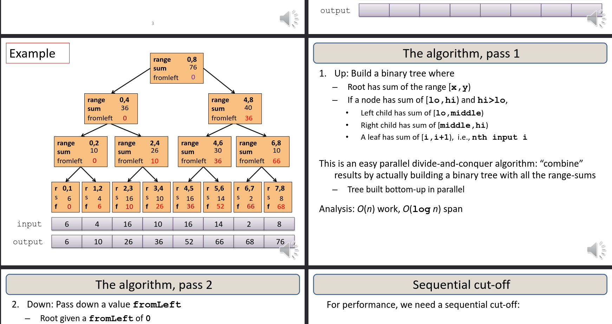

I understood that the sequential chain can be restructured into a tree where we get to split the matrix into blocks of columns, compute a "partial" factorization (that's the the reflectors V and the T factor) for each block independently, then combine the blocks in a second pass to RECOVER the full factorization. 

The combine step needs a correction term built from the mult of V and the transpose if it.

[NOTE] :: the kernel I actually ended up does not use the tree but instead within each panel I run the reflectors sequentially, and only the trailing update across panels is batched. 

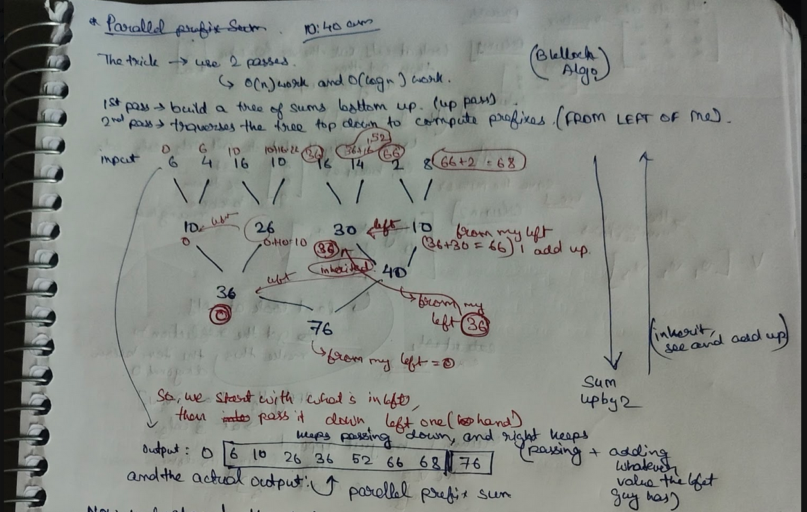

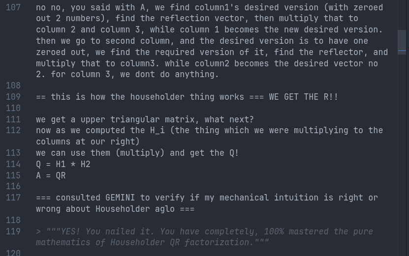

What we have to do is (say for a 3x3 matrix), [root node == columns 1-3], we have to create 2 subnodes called A and B. Node A will have 2 lead nodes which are col 1 and col 2. And Node B is a leaf node containing col 3. In first "up" pass, we will calculate the H_1 (reflection vector) for column and H_2 for column 2. Now you may ask, whether H_2 is to be calculated, after H_1 is applied to col2, then the answer is yes. We do say that in a local shared memory sandbox. Attaching a diagram of it here.

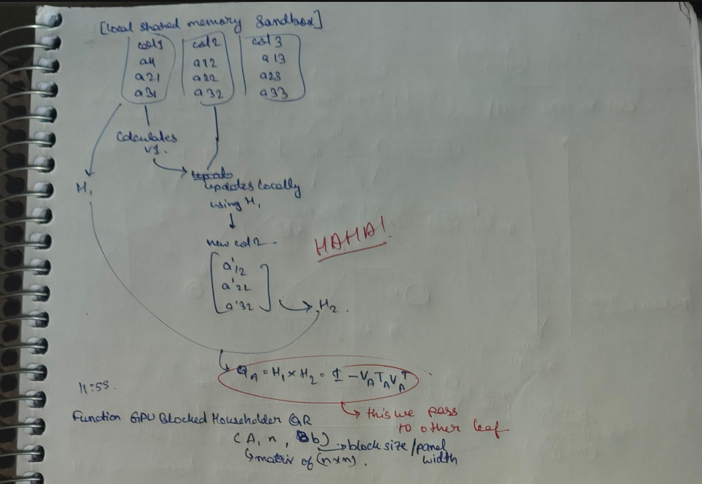

Then the values get stored in V and T, where V is the set of reflection vectors I found for the columns in the block and T is a small upper triangular matrix that encodes how those reflectors compose.

References:  
[1] https://www.gpumode.com/news/linear-algebra-kernels-age-of-research  
[2] https://www.stat.uchicago.edu/~lekheng/courses/309/books/Trefethen-Bau.pdf (Page 49 onwards)  
[3] https://www.cs.princeton.edu/courses/archive/fall20/cos326/lec/21-02-parallel-prefix-scan.pdf  

### cleaned up version

1. QR decomposition takes a sq matrix A and makes it Q(an orthogonal matrix).R(upper triangular matrix) here:
    - Q rotates space without stretching it
    - R that holds the actual scaling and combining instructions

2. Householder is used to compute these. We iterate the columns left to right and for each column, try to find a reflection vector v that ZEROES OUT everything below the diagonal of that column. 

3. From there we get to build the reflector H = `I - tau*v*v^T` from it. We apply H to every column to the right, then ove to the next column and repeat. 

So after n columns, the matrix has become R, and the product of all the H's is Q.

NOW LOOKING CLOSELY, this is SEQUENTIAL by construction! col i+1's reflector depends on col i having been applied first. This is same as prefix sum (1,2,3 -> 1, 1+2=3, (1+2)+3=6).

This is the basics of it. Then I followed the hint from the description to see if a paralell version. A sequential chain can be restructured into a tree, where independent sub blocks can be factored in PARALELL and then a COMBINE them into the full result. (V^T * V correction term is also used for combining one block's T factor with the next)

[I wrote a GEMM library few months back, because of which I got the second idea, which was to fetch block, compute partial result and then propagate that to the next block after arranging in a matrix to use the true power of GEMMs]

1. Instead of doing one column at a time and immediately running off to update the entire rest of the matrix after every single column, we group "b" number columns together and call that group a "PANEL" (say b=32) then we fully finish those 32 columns among themselves first (we have all 32 reflectors then) and THEN we touch the rest of the matrix!

2. Take b columns (panel), calc normal householder to get v1,H1, apply H1 to other b-1 columns, and calc v2 and H2 afterwards, do this as many times as required. At the end you will have "b" number of v's and a list of tau values from each reflector.

3. The product of the b reflectors can be written as a single combined transformation! which is the entire trick. after we are done with the first panel things look like [ finished panel | C ], we need to appyly combined trasnformation to C. Using a clean algebrain identity we get C_new  =  C - (V x T x V^T x C). then once C is updated, the next panel takes its first b columns from this updated C and starts the same process.

that is, we get:

- take b columns from the current matrix, factor one by one, get V, tau, T
- update the rest C in a beautiful GEMM
- move b columns to the right, repeat

that's it. a clear algebraic simplification.

## the code

Now with this mental model in mind, I used Claude Sonnet 4.6 to generate a kernel which does the same thing i stated before. You can see the same thing [here](code/base.py).

Now I ran it once, got 34 ms. Fair enough, but still we were at the bottom 10 in the leaderboard. Not good. So I used first principles thinking to find plausible bottlenecks in the code. 

Step 1 is to write down a hell lot of questions, (unedited from my rough notes):

```py
6. what can i improve upon the ai generated code?

my main aim is to do these:
1. am i wasting cycles by useless allocation?
2. where can memory be reused? is the copy required?
3. can i reduce cpu<->gpu<->cpu communication?
4. am i utilising compile time information?
---
1. what are the unnecessary round trips?
2. can i fuse something?
3. can i reduce allocations?
---
1. can i find something which can be further parallelizable?
2. how can i keep more things in the SRAM?
---
breaking something down to fundamental principles:
1. its all linear algebra, there must be variations of various steps
    a. what steps?
    b. how do they affect stability?
    c. does recomputing instead of storing have any effect?

based on what i flagged till now, i found these:
1. stupid allocations which are not required
2. unnecessary round trips 
3. sequential loops which can be exploited using wrap primitives

[allocation, reuse, host device traffic, compile time info, something totally mathematically new, sequential to parallel conversion]
```

See here: 

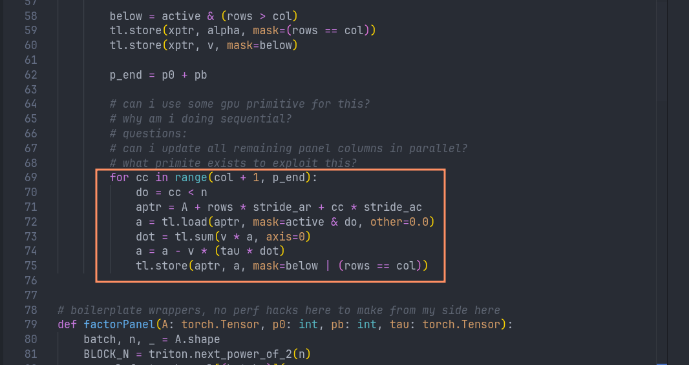
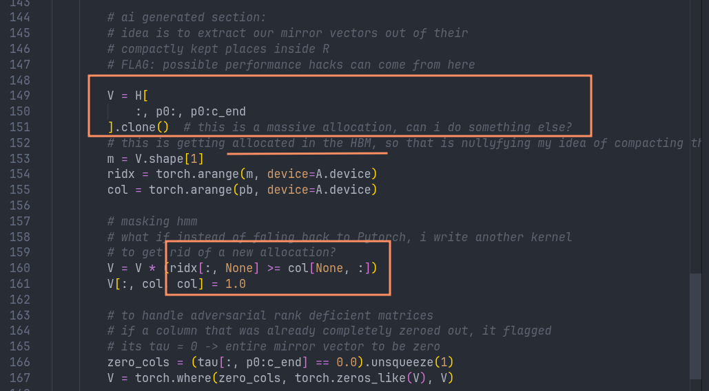

**I will keep the next portion of the writeup as-is from my rough notes.**

---

Then I consulted with claude:
```
things missing from my questions, is "tradeoffs"
1. arithmetic intensity/roofline (flops/byte moved)
    a. am i moving the same bytes more than once?
2. occupancy vs sram tradeoff is a tension 
    a. more sram/registers per program means fewer concurrent programs, means less latency hiding
3. numerical cost is a first class axis
```
big question: what to prioritize?
benchmark + analyse

they have a bad rate limit in their b200 gpu access
how am i supposed to profile my code?
plan is to stick to the arithmetic roofline model

> switching to roofline analysis instead through analytical method

-- discussed with claude cause i didnot feel like doing it myself --  
result: V allocation is a smaller fish, whereas the sequential redundant traffic is the whale! (though asymptotic, and we dont have the exact values of the constants)

1. aim now:
    a. pick the one which is troubling  
    b. swap that party ONLY  
    c. measure in test and publish in leaderboard   
    d. with our basic pseudo version we reached 34k us.  

claude messed it up. 
the tests did not pass.
1. looked at the triton kernel it was reconstructing something which we were not previously doing, dumped that specific portion for claude to verify, and bingo!

18:19 pm 

the results came 94k microseconds. shot up from 34k.
after analysing the test cases, the swap caused regression
at n = 32, we went from 134us to 37us
but for n >= 176, things got 4 to 11 times slower.
at small n the resident P block is cheap and the traffic reduction wins
lmao, we had flagged "constants are invisible"
that hit us bad

full panel resident P wins only for n <= 32; for n >= 176 it spills BLOCK_N * BLOCK_P to local memory and the spill traffic dominates that is 11 times slower. 

hence the flat 2D vec approach is the wrong shape of fix

18:46 

i thought about something fundamentally differnet in terms of using a mathematical aspect 
"cholesky" - did not pass the tests.
then i re-read the description, we HAVE to use the Householder reflection algo.

now, the lowest someone got was <2k microseconds
i was at 34k, and the pytorch version at 140k
They built mixed batches specifically to defeat the dispatch-to-CholeskyQR-fast-path trick lmao

something i saw :: """Low-bit FP16, FP8, or NVFP4 work is allowed only as an internal implementation strategy: returned factors must still be FP32 and must satisfy the same QR invariants."""

this is a hint? b200..that's a hint?
simple swaps or reducing cp<->gpu calls aint getting me to sub 2k microseconds

that leaves me with 2 ideas:
1. exploit the features of b200 which it brought: Native FP8 and FP4 tensor cores with microscaling (MXFP8 / NVFP4)

that.

memory bandwidth is what i need to reduce, and then construct back.
hence i need to understand:
1. what these pecision give us 
2. how they differ 
3. what the problem description allows and wants 
4. based on these contracts, what precision reconstruction can i do? - "correction?"
5. Tensor Memory Accelerator for async bulk copies. - can we fuse something?

-- consulted with Claude --

1. we try out MXFP8 and NVFP4
    a. tier 1: `torch._scaled_mm` 
    b. tier 2: true NVFP4/MXFP8 with 32 element microscaling via a Triton kernel

man its failing. 
https://www.iccs-meeting.org/archive/iccs2022/papers/133500064.pdf

can this help?

19:30 i feel like quitting.
let me try a small level.

i made this change 
```
        Tb = _build_T(V, tau[:, p0:c_end])

        # A_tr = H[:, p0:, c_end:]

        # this is a deliberate choice from my side
        # trying to bracket from right to left such that the GPU never has to
        # hold matrices of huge sizes, a tiny small buffer in registers is
        # all that is needed
        C = H[:, p0:, c_end:]
        W = V.transpose(-1, -2) @ C
        W = Tb.transpose(-1, -2) @ W
        # H[:, p0:, c_end:] = A_tr - V @ W
        # C = H[:, p0:, c_end:]
        C.baddbmm_(V, W, beta=1, alpha=-1)
```
from what was already in base.py

tests passed.

and timeout. ratelimited.

19:28 pm

breakthrough. a panel rewrite. fuck yeah. 
i was missing something I MYSELF HAD WRITTEN PREVIOUSLY! 
"1. what are the unnecessary round trips?" HELL YEAH! THE PANEL WAS FETCHING COLUMNS AGAIN AND AGAIN FROM HBM! WE COULD BRING EVERYTHING AT ONCE AND USE THE SRAM! IT WORKED! WE AT 12MS HELL YEAH!

checked the perf report, 4096 was taking most time, wanted to see how the default pytorch thing works for it to reject plausible culprints

performed better!! let's keep it like that

=== June 21, 8:25 am ===

1. what to do today?
2. flag potential improvements over our new panel?
3. some submission files in the leaderboard hinted towards "fused" - what can i possibly fuse?
4. aim is to get below 6k ms manually.

panel rewrite worked. now flagging what's next.

dumping the perf report to gemini yielded that batch with n=2048 is the whale to hunt, theres 267ms of dead bytes somewhere.

my intuition says that at that size things might not fit inside 
chcked sheet, it'd be a 512 kb tile, which is beyond what blackwell allows, got to shrink it 

easy fix 

```
if n == 2048: block = 16
else: block = 64 if n >= 256 else 32
```

7.1ms, we are at 56th rank YES

now, target is fixed

claude sonnet time: find me the suitable tile length, i cant use profiler, previously doing {old snippet} helped 

same logic for 512 and 1024
dropped to block=32, 512: 14.8 -> 10.0ms. 1024: 21.5 -> 9.5ms (2.3 times! blew past expectaitons
my estimate -- the spill was worse than the napkin math suggested
56th -> 38th rank hell yeah


what lever do i have left? 
changing alloc did no help, block size did, we have a warp size in there what if its causing occupancy to degare? then let's try warps. 
a few fail runs, ugh
BOOM!!
changin warp size helped!!

4.7ms club. 38th -> 32nd.

---

### things that did not work

Hi, this is me again. Came to summarise the weird rough stuff i had written:

1. what did not work in between (things i ommited)
- thinking of quantisation (wasted a LOT OF TIME HERE!), i forgot that the problem statement explicitly told about accuracy and precision. (NVFP4, FP8)

2. reading about Cholesky method, its NOT ALLOWD! wasted hours here. my fault, forgot about problem description

3. mixed precision with an idea to RECOVER lost precision, i was working on vibes, could not make it work, not worth it. moved on.

4. using global tf32 flag, failed tests

### things that worked

1. load tile to SRAM once, and then factor in to write back once :: we removed HBM traffic - known knowledge from kernel literature

2. a fallback for 4096 size with pytorch (did not expect tbh, just thought to measure a baseline)

3. 2048 was a guess, tile sizing is a factor for preventing spilling (something i wrote in my recent block about reverseing the NPU compiler)

4. changing warp numbers.

5. additional as i had previously flagged in my `qr()` function, there i used `baddbmm_` but it barely gave 0.7ms improvement so i did not log it. 

RESULT: currently at 4791.093 microseconds. 

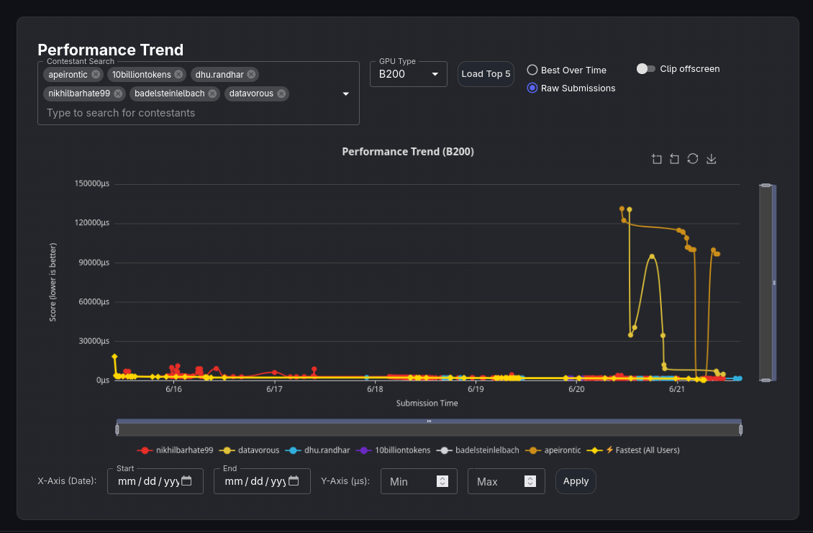

### todo 

1. TRY OUT THE NEW TREE STRUCTURE I STUDIED BUT DID NOT IMPLEMENT! 

flash attention came because someone thought of questioning the fundamental framing of calculating attention scores. i need to do the same. 

All the intermediate files are in [code/brainstorm/](code/brainstorm/) folder. 

2. clear up the mess.


